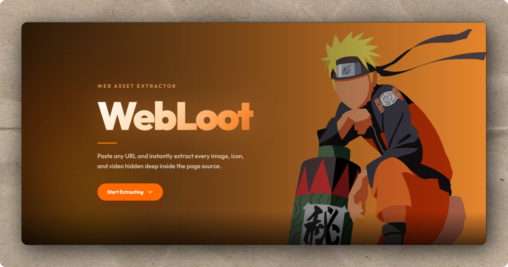

# WebLoot

A web asset extraction tool that lets you paste any URL and instantly pull every image, icon, and video embedded in that page. Built with a Next.js frontend and an Express backend.

---



---

## Features

- Extract all images, favicons/icons, and videos from any public URL
- Duplicate asset detection to filter redundant results
- One-click download for individual assets
- Animated, responsive UI built with Tailwind CSS and Framer Motion
- Clean REST API that can be consumed independently of the frontend

---

## Tech Stack

**Frontend**
- Next.js 16 (App Router)
- React 19
- TypeScript
- Tailwind CSS v4
- Framer Motion

**Backend**
- Node.js with Express 5
- Cheerio (HTML parsing)
- Axios (HTTP fetching)

---

## Project Structure

```
WebLoot/
├── server/                  Express API
│   ├── server.js            Entry point
│   ├── routes/
│   │   ├── analyzeRoute.js  POST /analyze
│   │   └── downloadRoute.js GET /download
│   ├── controllers/
│   │   ├── analyzeController.js
│   │   └── downloadController.js
│   ├── services/
│   │   ├── fetchSite.js     Fetches raw HTML from a URL
│   │   ├── extractImages.js Parses  tags and srcset
│   │   ├── extractIcons.js  Parses <link rel="icon"> tags
│   │   └── extractVideos.js Parses <video> and <source> tags
│   └── analyzers/
│       └── detectDuplicates.js
└── web/                     Next.js frontend
    └── src/
        ├── app/
        │   └── page.tsx     Home page
        └── components/
            ├── Analyzer.tsx  URL input + results layout
            └── ResultsGrid.tsx Asset grid with download buttons
```

---

## Getting Started

### Prerequisites

- Node.js 18 or higher
- npm

### 1. Clone the repository

```bash
git clone https://github.com/Rohan-2601/WebLoot.git
cd WebLoot
```

### 2. Start the backend

```bash
cd server
npm install
npm run dev
```

The API will be available at `http://localhost:5000`.

### 3. Start the frontend

Open a second terminal:

```bash
cd web
npm install
npm run dev
```

The app will be available at `http://localhost:3000`.

---

## API Reference

### POST /analyze

Fetches the given URL and returns all discovered assets.

**Request body**

```json
{
  "url": "https://example.com"
}
```

**Response**

```json
{
  "images": ["https://..."],
  "icons": ["https://..."],
  "videos": ["https://..."],
  "duplicates": ["https://..."],
  "totalAssets": 42
}
```

### GET /download?url=

Proxies and streams the asset file to the client as an attachment.

**Query parameter**

| Parameter | Type   | Description              |
|-----------|--------|--------------------------|
| url       | string | The direct URL of the asset to download |

---

## Environment Variables

Create a `.env.local` file inside the `web/` directory to override the default API URL:

```
NEXT_PUBLIC_API_URL=http://localhost:5000
```

---

## License

ISC
